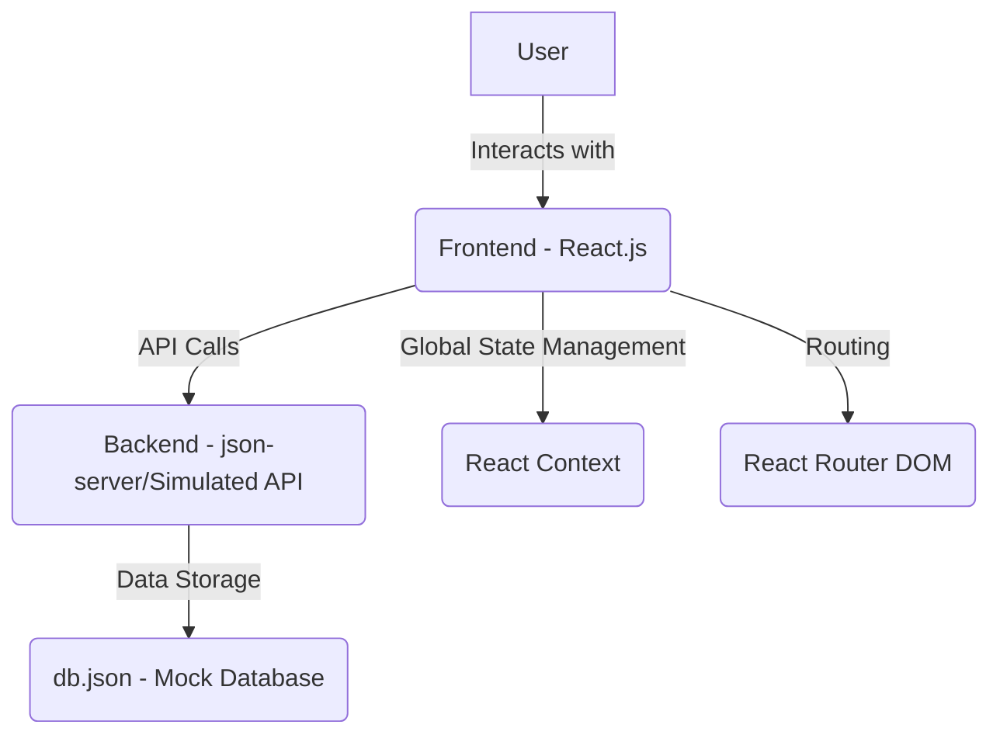

# Technical Details of Annu F&B Cost Controlling App

This document outlines the technical architecture and key implementation details of the Annu F&B Cost Controlling App, built according to the provided `devplan.txt`.

## 1. Architecture Overview
The application follows a client-server architecture, with a React-based frontend and a simulated RESTful API backend. State management is handled globally using React Context, and routing is managed by React Router DOM.

## 2. Tech Stack

| Layer        | Technology / Tool                               |
|--------------|-------------------------------------------------|
| **Frontend** | React.js, HTML, CSS, JavaScript (ES6+)          |
| **Build Tool** | Webpack                                         |
| **Transpiler** | Babel                                           |
| **Routing**  | React Router DOM                                |
| **State Management** | React Context API                               |
| **Mock Backend** | json-server                                     |
| **Package Manager** | npm                                             |

## 3. Key Implementation Details

### 3.1 Frontend Structure
- **`src/`**: Contains all source code.
  - **`src/components/`**: Reusable UI components, categorized by module (e.g., `inventory`, `purchasing`, `users`, `common`).
    - `common/`: Generic components like `Navbar`, `PrivateRoute`.
  - **`src/pages/`**: Top-level components representing different views/pages of the application.
  - **`src/services/`**: Contains `api.js` for all API interactions.
  - **`src/context/`**: Contains `AppContext.js` for global state management.
  - **`src/styles/`**: Global CSS styles.
  - **`src/Router.js`**: Defines application routes.
  - **`src/index.js`**: Application entry point.

### 3.2 State Management (React Context API)
- **`AppContext.js`**: Implements `createContext` and `useReducer`.
  - `initialState`: Defines the global state shape (e.g., `inventory`, `purchaseOrders`, `users`, `loading`, `error`, `user`, `isAuthenticated`).
  - `reducer`: A pure function that takes the current state and an action, returning a new state. Actions are dispatched from components to update the global state.
  - `AppProvider`: Wraps the entire application, making `state` and `dispatch` available to all descendant components via `useContext`.

### 3.3 API Interaction (`src/services/api.js`)
- Centralized module for all backend communication.
- Uses `fetch` API for making asynchronous HTTP requests (GET, POST, PUT, DELETE).
- Functions are organized by resource (e.g., `getInventory`, `addInventoryItem`, `updateUser`, `login`).
- Simulates backend logic for reports (e.g., `getDepartmentalCostSummary`, `getControllerCountVariance`) by processing data fetched from `json-server`.

### 3.4 Routing (React Router DOM)
- **`src/Router.js`**: Defines all application routes using `<Routes>` and `<Route>` components.
- **`PrivateRoute.js`**: A higher-order component that protects routes requiring authentication.
  - Checks `isAuthenticated` status from `AppContext`.
  - If authenticated, renders the requested component (`<Outlet>`).
  - If not authenticated, redirects to the `/login` page using `<Navigate>`.

### 3.5 Mock Backend (json-server)
- A lightweight Node.js server that creates a full fake REST API from a single `db.json` file.
- **`db.json`**: Stores all application data (inventory, purchase orders, users, sales, counts, waste, priceChanges, recipes, departments, categories).
- Provides endpoints for each resource (e.g., `/inventory`, `/purchaseOrders`, `/users`).
- Used for rapid frontend development without a full backend setup.

### 3.6 Build Process (Webpack & Babel)
- **`webpack.config.js`**: Configures Webpack for bundling:
  - Entry point: `src/index.js`.
  - Output: `bundle.js` in the `dist/` directory.
  - `babel-loader`: Transpiles JSX and modern JavaScript syntax.
  - `style-loader`, `css-loader`: Handle CSS imports.
  - `HtmlWebpackPlugin`: Injects the bundled JavaScript into `public/index.html`.
- **`.babelrc`**: Configures Babel presets (`@babel/preset-env` for ES6+ features and `@babel/preset-react` for JSX).

## 4. Data Model (as per `db.json`)

- **`inventory`**: `id`, `name`, `unit`, `category`, `department`, `quantity`, `cost`
- **`purchaseOrders`**: `id`, `supplier`, `expectedDate`, `status`, `items` (array of `{ name, quantity }`)
- **`users`**: `id`, `name`, `email`, `role`, `password`
- **`sales`**: `id`, `foodSales`, `beverageSales`, `totalSales`, `date`
- **`counts`**: `id`, `itemId`, `counted`, `date`
- **`waste`**: `id`, `itemId`, `quantity`, `reason`, `date`
- **`priceChanges`**: `id`, `itemId`, `oldPrice`, `newPrice`, `date`
- **`recipes`**: `id`, `name`, `sellingPrice`, `ingredients` (array of `{ itemId, quantity }`)
- **`departments`**: `id`, `name`
- **`categories`**: `id`, `name`

## 5. Future Considerations
- Replace `json-server` with a robust backend (Node.js/Express or Python/FastAPI with MySQL).
- Implement server-side logic for complex calculations and data integrity.
- Enhance UI/UX with a component library and responsive design.
- Add comprehensive testing (unit, integration, E2E).
- Implement more granular role-based access control and audit logging.
